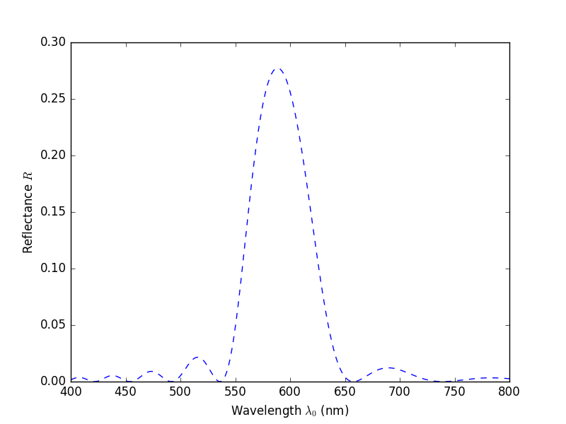

B4x4 
===========
This package can be used for simple optical simulation of cholesteric liquid crystals (A.K.A. chiralnematic liquid crystals).
It has been tested with Python 2.7.
I recomend begginers to install [Anaconda2](https://www.continuum.io/download) because it includes all the required modules for this package.

## Initialisation

To start, you need two files, B4x4.py and Berreman4x4.py, in the Python search path, see [here](https://docs.python.org/2/tutorial/modules.html#the-module-search-path) for instructions if you don't know what that means.
From a Python interactive session, (e.g. in terminal, iPython notebook, etc.) run the following commands.

```python
import B4x4
sim = B4x4.Factory()
```

## Simulating the reflectance of a cholesteric liquid crystal

To run simulations,

```python
result_left = sim.calculateL()
result_left.plot()
```




This figure shows the reflectance spectra of the simulated cholesteric liquid crystal, illuminated with left circularly polarized light (LCP).
This simulationd assumes a left handed helix of the cholesteric structure, therefore a prominent peak is found in the reflectance.
To simulate right circularly polarized light,

```python
result_right = sim.calculateR()
result_right.plot()
```

In this case, there is very little light reflected and no peak is seen.

## Changing parameters

The default parameters can be displayed by

```python
sim.settings
```

```
In [4]: sim.settings
Out[4]: 
{'angle': 0,
 'lbda_max': 800,
 'lbda_min': 400,
 'nSubstrate': 1.59,
 'nSuperstrate': 1,
 'ne': 1.586,
 'no': 1.524,
 'pitch': 190,
 'points': 101,
 'slices': 23,
 'stack': 10}
```

The parameters are described in the docstring.
iPython allows easy access to the docstring, simply put a question mark after the object and press enter.

```python
sim?
```

```
In [5]: test?
Type:        Factory
String form: <B4x4.Factory object at 0x10fcd6f50>
File:        ~/Documents/Scripts/Python/Berreman4x4/B4x4.py
Docstring:
Performes simulations using properties stored in class instances.
The default parameteres are based on Dumanli et. al.ACS Appl. Mater. Interfaces 2014, 6, 12302,
which is suitable for simulating dry wood pulp CNC films.

Methods
  calculateL: Returns instance of Spectrum containing LCP reflectance.
  calculateR: Same as calculateL but for RCP reflectance.
  matrix: Under construction.

Properties
  pitch:        pitch in nm (180 degree twist)
  no:           refractive index of ordinary ray
  ne:           refractive index of extraordinary ray
  nSuperstrate: refractive index of superstrate (air: n = 1)
  nSubstrate:   refractive index of suberstrate (PS: n = 1.59, SiO2: n=1.55)
  stack:        number of pitches (180 degree twist) in the structure
  angle:        angle of incidence in degrees
  lbda_min:     wavelength min (in meters)
  lbda_max:     wavelength max (in meters)
  points:       number of data points in simulation
  slices:       number of discrete anisotropic layers per 180 twist

Attribute
  settings:     All the above properties are stored in this.
```

To change the parameters of the simulation,

```python
sim.pitch = 230
sim.stack = 20
result_another = sim.calculateL()
result_another.plot()
```

It can be seen that the increase in the pitch and stack has changed the reflection spectrum.
To save the spectra,

```python
result_left.save('left_reflection.txt')
result_right.save('right_reflection.txt')
result_another.save('another_reflection.txt')
```

which will produce txt file that contains the spectra and other information.

## Acknowledgement
Note: Substantial amount of code used in this module is from [Olivier Castany's Python implementation of Berreman's 4x4 matrix method.](https://github.com/Berreman4x4/Berreman4x4)
